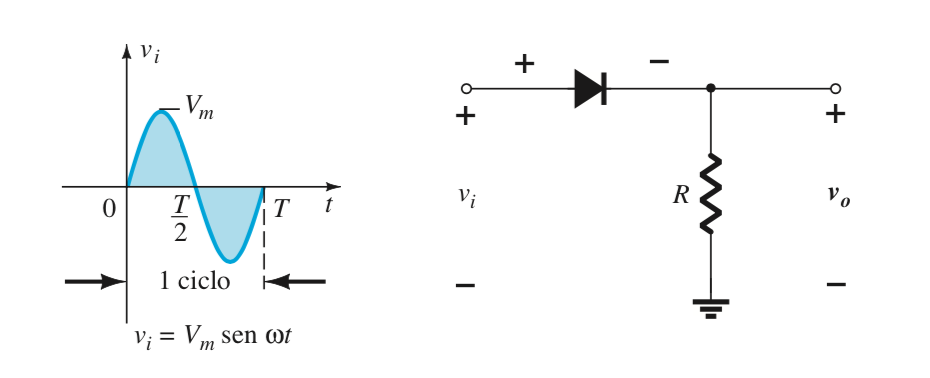
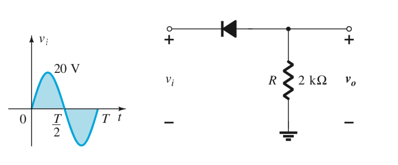
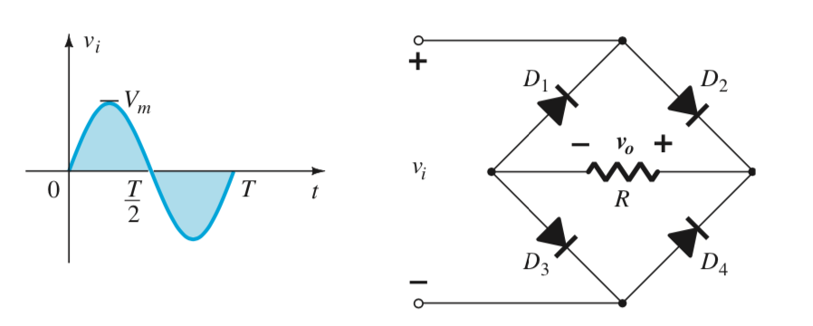
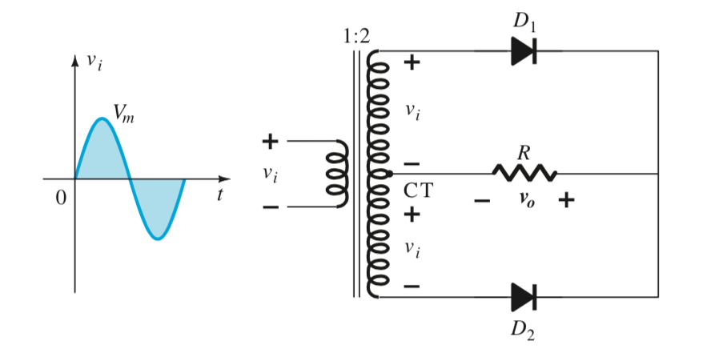

```{r setup, include=FALSE}
knitr::opts_chunk$set(echo = TRUE)
```

## Rectificadores de media onda

Como se vió en la clase pasa los dispositivos rectificadores de media onda convierten una señal analógica de entrada (por ejemplo una señal senoidal) como se muestra en la siguiente figura


```{r, echo=FALSE, out.width = "50%"}
x <- seq(-2,2,length=200)
y <-  sin(2*pi*x)
library(basetheme)
basetheme("deepblue")
plot(x,y, type="l", lwd=3, col="red",main="Señal senoidal", xlab="Tiempo", ylab="Valores")
grid(col="gray30")
```

en una señal de salida de la siguiente forma:

```{r, echo=FALSE, out.width = "50%"}
x  <- seq(-2,2,length=200)
y  <-  sin(2*pi*x)
y1 <-  ifelse(y < 0, 0, y)
library(basetheme)
basetheme("deepblue")
plot(x,y1, type="l", lwd=3, col="green",main="Señal senoidal de media onda", xlab="Tiempo", ylab="Valores")
grid(col="gray30")
```

Lo anterior se hace mediante circuitos rectificadores que utilizan un diodo "rectificador". Los circuitos utilizados son los que se muestran a continuación en la siguiente figura:

{width=50% }

{width=50% }


### Actvidades

1. Simular el circuito de la figura 1 con $V_m = 20 \sin(100 \pi t)$ y $R=2 k\Omega$.

2. Simular el circuito de la figura 2 con $V_m = 20 \sin(120 \pi t)$ y $R=2 k\Omega$.


## Rectificador de onda completa.

A diferencia del circuito rectificador de media onda, el circuito rectificador de onda completa genera la siguiente señal de salida:

```{r, echo=FALSE, out.width = "50%"}
x  <- seq(-1,1,length=500)
y  <-  sin(2*pi*x)
y1 <-  ifelse(y < 0, -y, y)
library(basetheme)
basetheme("deepblue")
plot(x,y1, type="l", lwd=3, col="green",main="Señal senoidal de onda completa", xlab="Tiempo", ylab="Valores")
grid(col="gray30")
```

Con lo cual su voltaje de CD de salida pasa de $V_o = 0.318V_m$ a $V_o = 0.636V_m$. Además, el circuito rectificador de onda completa requiere un filtro de salida más sencillo que aquel que se pudiese utilizar en un rectificador de media onda. Los circuitos utilizados para la rectificación de onda completa son los siguientes:

1. El que se basa en un puente de diodos:

{width=50% }


{width=50% }


{width=50% }


### Actividades

1. Simular los circuitos rectificadores de onda completa usando $V_m= 10\sin(120 \pi t)$ y con $R= 1 k\Omega$.

Nota: en todos los circuitos se deberán utilizar diodos de silicio.